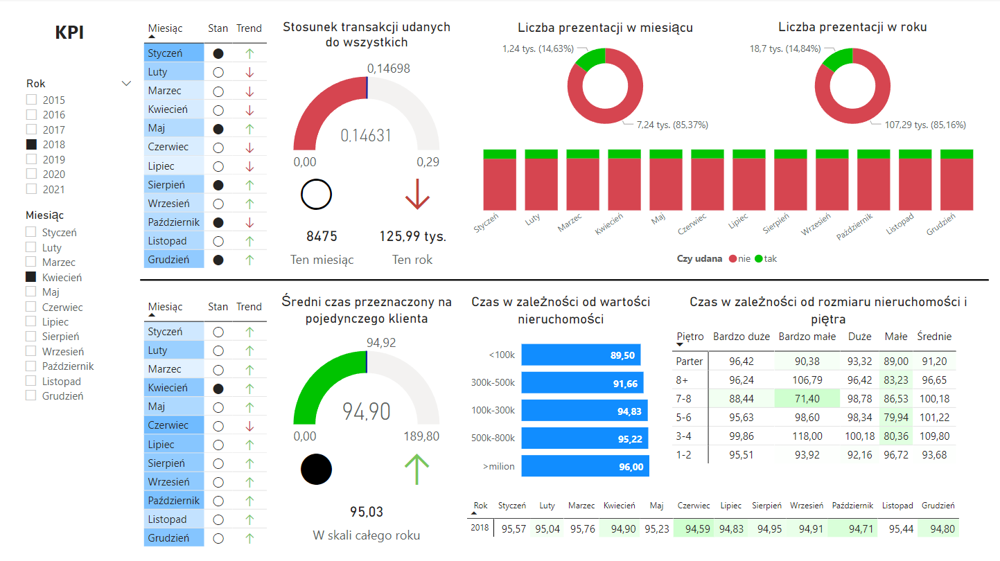
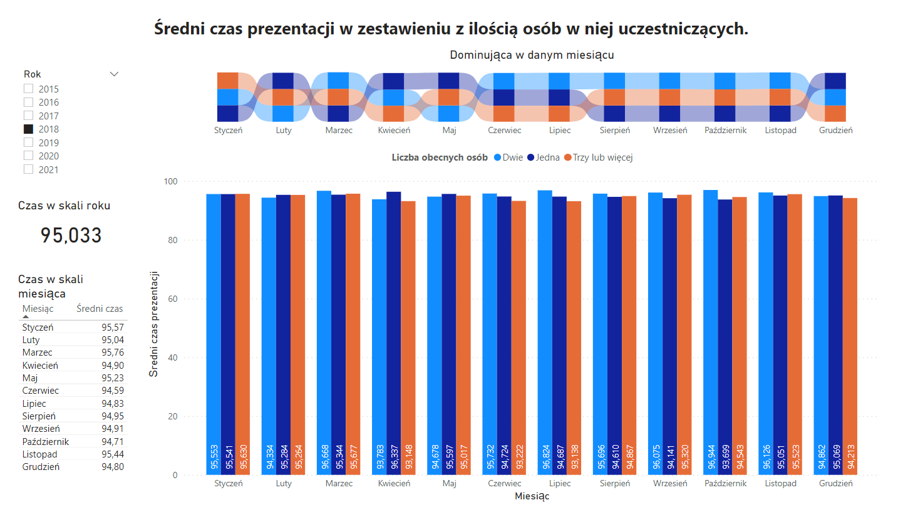
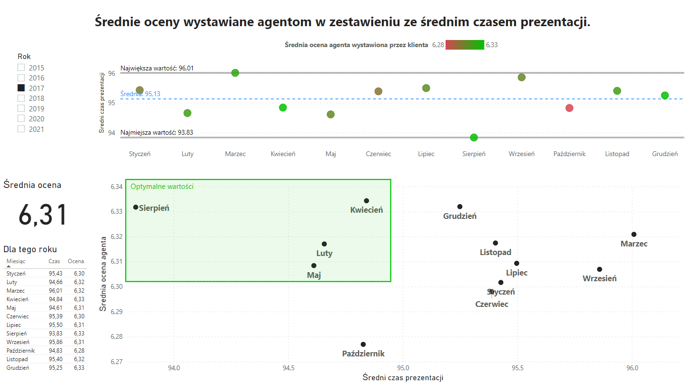
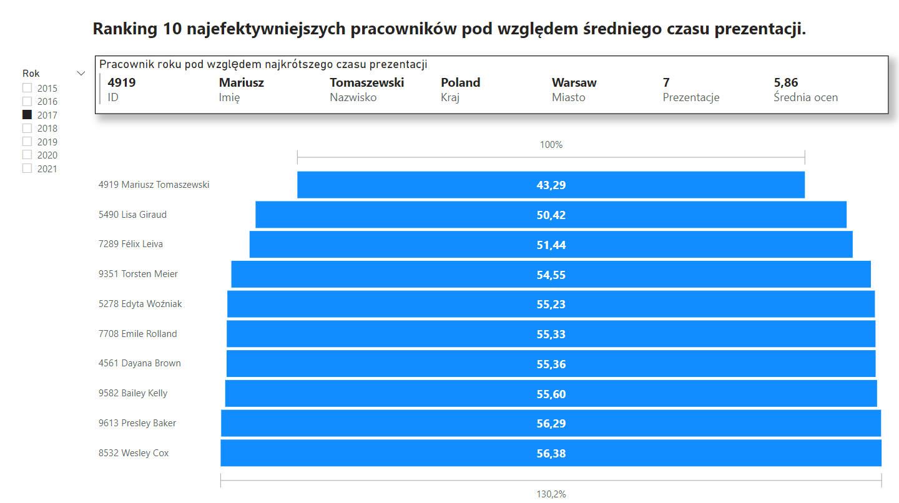
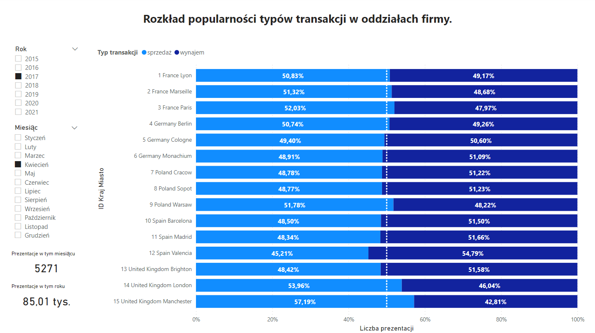

# Studies Data Warehouse project

## About:
- Database SQL and ETL files created as a part of Data Warehouses course project.
- Example BI visualization implemented in MS Power BI.

## Data samples:
- Data samples created with generator developed by [**@Majkelevsky**](https://github.com/Majkelevsky/)

## Business Intelligence and data visualization:

